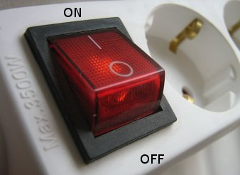

# Config.h

###APM_Config.h

Before analizing the `Config.h`, it would be useful to comment the [APM_Config.h](https://github.com/diydrones/ardupilot/blob/master/APMrover2/APM_Config.h) file, which also stores configuration matters.

The `APM_Config.h` file is just a placeholder for your configuration file.  If you wish to change any of the setup parameters from their default values, place the appropriate `#define` statements here.

So the `APM_Config.h` funtion is to deal with your parameters and configuration choice.

On the other hand, `Config.h` contains default and automatic configuration details. As you will see there are many warnings alont the file to avoid changes that can lead to desconfiguration.

###Config.h

The [Config.h](https://github.com/BeaglePilot/ardupilot/blob/master/APMrover2/config.h) defines default configuration so, as you can see, it starts with a warning:

```cpp
// -*- tab-width: 4; Mode: C++; c-basic-offset: 4; indent-tabs-mode: nil -*-
//
//////////////////////////////////////////////////////////////////////////////
//////////////////////////////////////////////////////////////////////////////
//
// WARNING WARNING WARNING WARNING WARNING WARNING WARNING WARNING WARNING
//
//  DO NOT EDIT this file to adjust your configuration.  Create your own
//  APM_Config.h and use APM_Config.h.example as a reference.
//
// WARNING WARNING WARNING WARNING WARNING WARNING WARNING WARNING WARNING
///
//////////////////////////////////////////////////////////////////////////////
//////////////////////////////////////////////////////////////////////////////
//
// Default and automatic configuration details.
//
// Notes for maintainers:
//
// - Try to keep this file organised in the same order as APM_Config.h.example
//
...
```
```cpp
#include "defines.h"

///
/// DO NOT EDIT THIS INCLUDE - if you want to make a local change, make that
/// change in your local copy of APM_Config.h.
///
#include "APM_Config.h"  // <== THIS INCLUDE, DO NOT EDIT IT. EVER.
///
/// DO NOT EDIT THIS INCLUDE - if you want to make a local change, make that
/// change in your local copy of APM_Config.h.
///
...
```
The [defines.h](https://github.com/BeaglePilot/ardupilot/blob/master/APMrover2/defines.h) contains internal definitions, that should be included in the configuration.

As commented above, the `APM_config.h ` file includes the local configuration details.

```cpp


#if defined( __AVR_ATmega1280__ )
 // default choices for a 1280. We can't fit everything in, so we
 // make some popular choices by default
 #define LOGGING_ENABLED DISABLED
 #ifndef MOUNT
 # define MOUNT DISABLED
 #endif
 #ifndef CAMERA
 # define CAMERA DISABLED
 #endif
#endif

...
```
This slice of code defines the default status of the Camera and the mount disabled. In order to enable it when really connecting them.
```cpp
// Just so that it's completely clear...
#define ENABLED			1
#define DISABLED		0
...
```
I would remark this slice of code. Enabled is defined with the binary value 1 and Disabled with the 0. It is important to note that 1 and 0 refer the **binary values** of these numbers. In electronics, generally, the binary value 1 refers something working (like a closed switch) and the value 0 the oposite (like a open switch).
This concep will appear frecuently with dealing with electronic devices.



```cpp
//////////////////////////////////////////////////////////////////////////////
// sensor types

#define CONFIG_INS_TYPE HAL_INS_DEFAULT
#define CONFIG_BARO     HAL_BARO_DEFAULT
#define CONFIG_COMPASS  HAL_COMPASS_DEFAULT

#ifdef HAL_SERIAL0_BAUD_DEFAULT
# define SERIAL0_BAUD HAL_SERIAL0_BAUD_DEFAULT
#endif
...
```

Here four types of sensors are configures: barometer, compass data sensor, serial sensor and ins type sensor.

https://github.com/BeaglePilot/ardupilot/blob/master/APMrover2/config.h#L62
