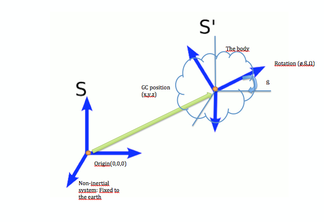

# GCS_Mavlink.pde

Link to the code:[GCS_Mavlink.pde](https://github.com/BeaglePilot/ardupilot/blob/master/APMrover2/GCS_Mavlink.pde)

---

**MavLink** is a communication protocol for MAV (Micro Aerial Vehicles) that has nowadays been extended to all kind of drones (both aerial and terrestrial).

A **Ground Control station (GCS)** is a land- or sea-based control center that provides the facilities for human control of unmanned vehicles in the air or in space.When talking about a rover it can be as simple as a remote control device.

---

In this file the MavLink protocol is implemented and adapted to a rover.Remote control methods and sensors (rate control, attitude stabilization, yaw, altitud...) are enabled.

```cpp

// default sensors are present and healthy: gyro, accelerometer, rate_control, attitude_stabilization, yaw_position, altitude control, x/y position control, motor_control
#define MAVLINK_SENSOR_PRESENT_DEFAULT (MAV_SYS_STATUS_SENSOR_3D_GYRO | MAV_SYS_STATUS_SENSOR_3D_ACCEL | MAV_SYS_STATUS_SENSOR_ANGULAR_RATE_CONTROL | MAV_SYS_STATUS_SENSOR_ATTITUDE_STABILIZATION | MAV_SYS_STATUS_SENSOR_YAW_POSITION | MAV_SYS_STATUS_SENSOR_XY_POSITION_CONTROL | MAV_SYS_STATUS_SENSOR_MOTOR_OUTPUTS | MAV_SYS_STATUS_AHRS)

// use this to prevent recursion during sensor init
static bool in_mavlink_delay;

// true if we are out of time in our event timeslice
static bool	gcs_out_of_time;

// check if a message will fit in the payload space available
#define CHECK_PAYLOAD_SIZE(id) if (payload_space < MAVLINK_MSG_ID_## id ##_LEN) return false
...
```
Defines some variables and stablish the default configuration for sensors.

You can fingure out what each sensor configuration does [here](https://github.com/diydrones/ardupilot/blob/master/libraries/GCS_MAVLink/include/mavlink/v1.0/common/common.h#L214) as part of `GCS_MAVLink/include/mavlink/v1.0/common/common.h`file.

```cpp
/*
 *  !!NOTE!!
 *
 *  the use of NOINLINE separate functions for each message type avoids
 *  a compiler bug in gcc that would cause it to use far more stack
 *  space than is needed. Without the NOINLINE we use the sum of the
 *  stack needed for each message type. Please be careful to follow the
 *  pattern below when adding any new messages
 */

 static NOINLINE void send_heartbeat(mavlink_channel_t chan)
{
    uint8_t base_mode = MAV_MODE_FLAG_CUSTOM_MODE_ENABLED;
    uint8_t system_status = MAV_STATE_ACTIVE;
    uint32_t custom_mode = control_mode;

    if (failsafe.triggered != 0) {
        system_status = MAV_STATE_CRITICAL;
    }
...
```
Stablishes the system status to ACTIVE and the control mode. Checks if the failsafe event is set (it means triggered() returns something different from 0). In case the failsafe event is set the status is changed to CRITICAL.

```cpp
...
    // work out the base_mode. This value is not very useful
    // for APM, but we calculate it as best we can so a generic
    // MAVLink enabled ground station can work out something about
    // what the MAV is up to. The actual bit values are highly
    // ambiguous for most of the APM flight modes. In practice, you
    // only get useful information from the custom_mode, which maps to
    // the APM flight mode and has a well defined meaning in the
    // ArduPlane documentation
    switch (control_mode) {
    case MANUAL:
    case LEARNING:
    case STEERING:
        base_mode = MAV_MODE_FLAG_MANUAL_INPUT_ENABLED;
        break;
    case AUTO:
    case RTL:
    case GUIDED:
        base_mode = MAV_MODE_FLAG_GUIDED_ENABLED;
// note that MAV_MODE_FLAG_AUTO_ENABLED does not match what
        // APM does in any mode, as that is defined as "system finds its own goal
        // positions", which APM does not currently do
        break;
    case INITIALISING:
        system_status = MAV_STATE_CALIBRATING;
        break;
    case HOLD:
        system_status = 0;
        break;
    }
...
```
Depending on the `control_mode` some variables are defined.The `MAV_MODE_GLAG` are defined as part of PX4 firmware, you can find the definitions [here](https://github.com/diydrones/ardupilot/blob/master/libraries/GCS_MAVLink/include/mavlink/v1.0/common/common.h#L94).

- `MAV_MODE_FLAG_GUIDED_ENABLED`:guided mode enabled, system flies MISSIONs / mission items


- `MAV_MODE_FLAG_AUTO_ENABLED`:autonomous mode enabled, system finds its own goal positions. Guided flag can be set or not, depends on the actual implementation.

At [ardupilot/libraries/GCS_MAVLink/include/mavlink/v1.0](https://github.com/diydrones/ardupilot/tree/master/libraries/GCS_MAVLink/include/mavlink/v1.0) you can find all these identifiers.

```cpp

#if ENABLE_STICK_MIXING==ENABLED
    if (control_mode != INITIALISING) {
        // all modes except INITIALISING have some form of manual
        // override if stick mixing is enabled
        base_mode |= MAV_MODE_FLAG_MANUAL_INPUT_ENABLED;
    }
#endif
...
```
 Remote control input is (`MAV_MODE_FLAG_MANUAL_INPUT_ENABLED`), in case the control mode is not INITIALISING.

```cpp

#if HIL_MODE != HIL_MODE_DISABLED
    base_mode |= MAV_MODE_FLAG_HIL_ENABLED;
#endif

    // we are armed if we are not initialising
    if (control_mode != INITIALISING && ahrs.get_armed()) {
        base_mode |= MAV_MODE_FLAG_SAFETY_ARMED;
    }

    // indicate we have set a custom mode
    base_mode |= MAV_MODE_FLAG_CUSTOM_MODE_ENABLED;

    mavlink_msg_heartbeat_send(
        chan,
        MAV_TYPE_GROUND_ROVER,
        MAV_AUTOPILOT_ARDUPILOTMEGA,
        base_mode,
        custom_mode,
        system_status);
}
...
```
The Hil mode is defined in the [APMrover2/config.h](https://github.com/diydrones/ardupilot/blob/master/APMrover2/config.h#L63).As mentioned before, the simulation Hardware-in-the-loop (HIL) is a technique used for the development and testing of complex embedded systems in real time.

First this code checks if HIL is enabled in some way.
` MAV_MODE_FLAG_HIL_ENABLED` also enables hardware in the loop simulation (all motors / actuators are blocked, but internal software is full operational).

After that ` MAV_MODE_FLAG_SAFETY_ARMED` sets MAV safety to armed. Motors are enabled / running / can start, that means: "Ready to fly".

Then `MAV_MODE_FLAG_CUSTOM_MODE_ENABLED` is used to set a custom mode(a bitfield for use for autopilot-specific flags).

You can find the implementation of `mavlink_msg_heartbeat_send`[here](https://github.com/diydrones/ardupilot/blob/master/libraries/GCS_MAVLink/include/mavlink/v1.0/common/mavlink_msg_heartbeat.h#L168), for sending a heartbeat message.

**NOTE**- `mavlink_msg...` can be found at [/GCS_MAVLink/include/mavlink/v1.0/ardupilotmega](https://github.com/diydrones/ardupilot/tree/master/libraries/GCS_MAVLink/include/mavlink/v1.0/common) or at [/GCS_MAVLink/include/mavlink/v1.0/common](https://github.com/diydrones/ardupilot/tree/master/libraries/GCS_MAVLink/include/mavlink/v1.0/common).


```cpp


static NOINLINE void send_attitude(mavlink_channel_t chan)
{
    Vector3f omega = ahrs.get_gyro();
    mavlink_msg_attitude_send(
        chan,
        millis(),
        ahrs.roll,
        ahrs.pitch,
        ahrs.yaw,
        omega.x,
        omega.y,
        omega.z);
}
...
```
This function `send_attitude` sends a message containing the attitude variables' values:

- `get_gyro()` return a smoothed and corrected gyro vector.


- `mavlink_msg_attitude_send` implemented [here](https://github.com/diydrones/ardupilot/blob/master/libraries/GCS_MAVLink/include/mavlink/v1.0/common/mavlink_msg_attitude.h#L180) send an attitude message:
 +  (x,y,z) for position of the certer of gravity respect to a non-inertial system.
 + (roll,pitch,yaw) for orientation relative to a body- fixed system (inertial) .

Note that the position of a body is perfectly determined with both the position of a point (GC) and the rotated angles relative to a given position.



```cpp

static NOINLINE void send_extended_status1(mavlink_channel_t chan)
{
    uint32_t control_sensors_present;
    uint32_t control_sensors_enabled;
    uint32_t control_sensors_health;

    // default sensors present
    control_sensors_present = MAVLINK_SENSOR_PRESENT_DEFAULT;

...
```
This initilized `contol_sensors_present` to the default sensors stablished in the firts line of this code.
```cpp
...
    // first what sensors/controllers we have
    if (g.compass_enabled) {
        control_sensors_present |= MAV_SYS_STATUS_SENSOR_3D_MAG; // compass present
    }
    if (gps.status() > AP_GPS::NO_GPS) {
        control_sensors_present |= MAV_SYS_STATUS_SENSOR_GPS;
    }
    ...
    ```
Enables the GPS sensor and the Magnetometer sensor if they exist.
```cpp
...
    // all present sensors enabled by default except rate control, attitude stabilization, yaw, altitude, position control and motor output which we will set individually
    control_sensors_enabled = control_sensors_present & (~MAV_SYS_STATUS_SENSOR_ANGULAR_RATE_CONTROL & ~MAV_SYS_STATUS_SENSOR_ATTITUDE_STABILIZATION & ~MAV_SYS_STATUS_SENSOR_YAW_POSITION & ~MAV_SYS_STATUS_SENSOR_XY_POSITION_CONTROL & ~MAV_SYS_STATUS_SENSOR_MOTOR_OUTPUTS);

    switch (control_mode) {
    case MANUAL:
    case HOLD:
        break;

    case LEARNING:
    case STEERING:
        control_sensors_enabled |= MAV_SYS_STATUS_SENSOR_ANGULAR_RATE_CONTROL; // 3D angular rate control
        control_sensors_enabled |= MAV_SYS_STATUS_SENSOR_ATTITUDE_STABILIZATION; // attitude stabilisation
        break;

    case AUTO:
    case RTL:
    case GUIDED:
        control_sensors_enabled |= MAV_SYS_STATUS_SENSOR_ANGULAR_RATE_CONTROL; // 3D angular rate control
        control_sensors_enabled |= MAV_SYS_STATUS_SENSOR_ATTITUDE_STABILIZATION; // attitude stabilisation
        control_sensors_enabled |= MAV_SYS_STATUS_SENSOR_YAW_POSITION; // yaw position
        control_sensors_enabled |= MAV_SYS_STATUS_SENSOR_XY_POSITION_CONTROL; // X/Y position control
        control_sensors_enabled |= MAV_SYS_STATUS_SENSOR_MOTOR_OUTPUTS; // motor control
        break;

    case INITIALISING:
        break;
    }
...
```
Depending on the `control_mode` input different sensors are enabled.

```cpp
...

    // default to all healthy except compass and gps which we set individually
    control_sensors_health = control_sensors_present & (~MAV_SYS_STATUS_SENSOR_3D_MAG & ~MAV_SYS_STATUS_SENSOR_GPS);
    if (g.compass_enabled && compass.healthy(0) && ahrs.use_compass()) {
        control_sensors_health |= MAV_SYS_STATUS_SENSOR_3D_MAG;
    }
    if (gps.status() >= AP_GPS::GPS_OK_FIX_3D) {
        control_sensors_health |= MAV_SYS_STATUS_SENSOR_GPS;
    }
    if (!ins.healthy()) {
        control_sensors_health &= ~(MAV_SYS_STATUS_SENSOR_3D_GYRO | MAV_SYS_STATUS_SENSOR_3D_ACCEL);
    }

    if (!ahrs.healthy()) {
        // AHRS subsystem is unhealthy
        control_sensors_health &= ~MAV_SYS_STATUS_AHRS;
    }

    int16_t battery_current = -1;
    int8_t battery_remaining = -1;

    if (battery.monitoring() == AP_BATT_MONITOR_VOLTAGE_AND_CURRENT) {
        battery_remaining = battery.capacity_remaining_pct();
        battery_current = battery.current_amps() * 100;
    }
    ...
    ```
This slice of code check if a device is connected and enabled in a healthy way.Depending on this initialize the corresponding sensor.That means, this slice is a **health controller**.

For example:
`ahrs.healthy()` checks if the AHRS subsystem  is healthy (boolean function). If it is unhealthy `MAV_SYS_STATUS_AHRS`is called to find out the AHRS subsystem health.

```cpp
...

    mavlink_msg_sys_status_send(
        chan,
        control_sensors_present,
        control_sensors_enabled,
        control_sensors_health,
        (uint16_t)(scheduler.load_average(20000) * 1000),
        battery.voltage() * 1000, // mV
        battery_current,        // in 10mA units
        battery_remaining,      // in %
        0, // comm drops %,
        0, // comm drops in pkts,
        0, 0, 0, 0);

}
...
```
`mavlink_msg_sys_status_send`implemented [here](https://github.com/diydrones/ardupilot/blob/master/libraries/GCS_MAVLink/include/mavlink/v1.0/common/mavlink_msg_sys_status.h#L234) sends a message showing the **status of the system**. The message includes data about:   which controllers and sensors are present, which are enabled, which controllers and sensors are operational or have an error...(Value of 0: not present. Value of 1: present).

```cpp
static void NOINLINE send_location(mavlink_channel_t chan)
{
    uint32_t fix_time;
    // if we have a GPS fix, take the time as the last fix time. That
    // allows us to correctly calculate velocities and extrapolate
    // positions.
    // If we don't have a GPS fix then we are dead reckoning, and will
    // use the current boot time as the fix time.

    if (gps.status() >= AP_GPS::GPS_OK_FIX_2D) {
        fix_time = gps.last_fix_time_ms();
    } else {
        fix_time = millis();
    }
    const Vector3f &vel = gps.velocity();
    mavlink_msg_global_position_int_send(
        chan,
        fix_time,
        current_loc.lat,                   // in 1E7 degrees
        current_loc.lng,                   // in 1E7 degrees
        gps.location().alt * 10UL,         // millimeters above sea level
        (current_loc.alt - home.alt) * 10, // millimeters above ground
        vel.x * 100,  // X speed cm/s (+ve North)
        vel.y * 100,  // Y speed cm/s (+ve East)
        vel.z * -100, // Z speed cm/s (+ve up)
        ahrs.yaw_sensor);
}
...
```
Some notes about the functions called.

- `last_fix_time_ms()` returns the time we got our last fix in system milliseconds. This is used when calculating how far we might have moved since that fix.


- `gps.velocity()`returns 3D velocity in NED format.


- `location()`returns the location of last fix.


- `yaw_sensor` is an  `AP_InertialSensor`exported to AHRS, which can be defined as, a gyroscopic device that measures a vehicle’s angular velocity around its vertical axis.

- `current_loc`is a Location instance. ALl location functions are stored in [AP_Math]
The information returned by all these functions is used when calling `mavlink_msg_global_position_int_send`, implemented [here](https://github.com/diydrones/ardupilot/blob/master/libraries/GCS_MAVLink/include/mavlink/v1.0/common/mavlink_msg_global_position_int.h#L198).

```cpp

static void NOINLINE send_nav_controller_output(mavlink_channel_t chan)
{
    mavlink_msg_nav_controller_output_send(
        chan,
        lateral_acceleration, // use nav_roll to hold demanded Y accel
        gps.ground_speed() * ins.get_gyro().z, // use nav_pitch to hold actual Y accel
        nav_controller->nav_bearing_cd() * 0.01f,
        nav_controller->target_bearing_cd() * 0.01f,
        wp_distance,
        0,
        groundspeed_error,
        nav_controller->crosstrack_error());
}
...
```

`send_nav_controller_output` is implemented [here](https://github.com/diydrones/ardupilot/blob/master/libraries/GCS_MAVLink/include/mavlink/v1.0/common/mavlink_msg_nav_controller_output.h#L189) and sends a `nav_controller_output` message.

The `nav_controller`methods are defined in [AP_Navigation.h](https://github.com/diydrones/ardupilot/blob/master/libraries/AP_Navigation/AP_Navigation.h#L35):

- `nav_bearing_cd()` returns the tracking bearing that the navigation controller is using in centi-degrees. This is used to display an arrow on ground stations showing the effect of the cross-tracking in the controller.

- `target_bearing_cd()`returns the target bearing in centi-degrees. This is the bearing from the vehicles current position to the target waypoint.

- `crosstrack_error()`returns the crosstrack error in meters. This is the distance inthe X-Y plane that we are off the desired track.

```cpp

#if HIL_MODE != HIL_MODE_DISABLED
static void NOINLINE send_servo_out(mavlink_channel_t chan)
{
    // normalized values scaled to -10000 to 10000
    // This is used for HIL.  Do not change without discussing with
    // HIL maintainers
    mavlink_msg_rc_channels_scaled_send(
        chan,
        millis(),
        0, // port 0
        10000 * channel_steer->norm_output(),
        0,
        10000 * channel_throttle->norm_output(),
        0,
        0,
        0,
        0,
        0,
        receiver_rssi);
}
#endif
...
```
If HIL_MODE is enabled send a` mavlink_msg_rc_channels_scaled_send` implemented [here](https://github.com/diydrones/ardupilot/blob/master/libraries/GCS_MAVLink/include/mavlink/v1.0/common/mavlink_msg_rc_channels_scaled.h#L216).This send instructions to the corresponding channel, in this case: steer and throttle control channels.

```cpp

static void NOINLINE send_radio_out(mavlink_channel_t chan)
{
#if HIL_MODE == HIL_MODE_DISABLED || HIL_SERVOS
    mavlink_msg_servo_output_raw_send(
        chan,
        micros(),
        0,     // port
        hal.rcout->read(0),
        hal.rcout->read(1),
        hal.rcout->read(2),
        hal.rcout->read(3),
        hal.rcout->read(4),
        hal.rcout->read(5),
        hal.rcout->read(6),
        hal.rcout->read(7));
...
```
If the HIL_MODE is disabled calls `mavlink_msg_servo_output_raw_send` implemented [here](https://github.com/diydrones/ardupilot/blob/master/libraries/GCS_MAVLink/include/mavlink/v1.0/common/mavlink_msg_servo_output_raw.h#L207). Send a message to the servo output port for using RCOutput `read()` method to read back current output state, as either single channel or array of channels.

```cpp
...
#else
    mavlink_msg_servo_output_raw_send(
        chan,
        micros(),
        0,     // port
        RC_Channel::rc_channel(0)->radio_out,
        RC_Channel::rc_channel(1)->radio_out,
        RC_Channel::rc_channel(2)->radio_out,
        RC_Channel::rc_channel(3)->radio_out,
        RC_Channel::rc_channel(4)->radio_out,
        RC_Channel::rc_channel(5)->radio_out,
        RC_Channel::rc_channel(6)->radio_out,
        RC_Channel::rc_channel(7)->radio_out);
#endif
}
...
```
If HIL_MODE is enabled uses [RC_Channel](https://github.com/diydrones/ardupilot/blob/master/libraries/RC_Channel/RC_Channel.h#L124) manager.

```cpp

static void NOINLINE send_vfr_hud(mavlink_channel_t chan)
{
    mavlink_msg_vfr_hud_send(
        chan,
        gps.ground_speed(),
        gps.ground_speed(),
        (ahrs.yaw_sensor / 100) % 360,
        (uint16_t)(100 * fabsf(channel_throttle->norm_output())),
        current_loc.alt / 100.0,
        0);
}
...
```

`mavlink_msg_vrf_hud_send` implemented [here](https://github.com/diydrones/ardupilot/blob/master/libraries/GCS_MAVLink/include/mavlink/v1.0/common/mavlink_msg_vfr_hud.h#L171) send information about: Current airspeed in m/s and ground speed in m/s,
current throttle setting, current altitude (MSL)...

 This information is get through `gps.ground_speed()`, `ahrs.yaw_sensor`...)

```cpp

// report simulator state
static void NOINLINE send_simstate(mavlink_channel_t chan)
{
#if CONFIG_HAL_BOARD == HAL_BOARD_AVR_SITL
    sitl.simstate_send(chan);
#endif
}
...
```
`void simstate_send(mavlink_channel_t chan);`for reporting the state.Implemented [here](https://github.com/BeaglePilot/ardupilot/blob/master/libraries/SITL/SITL.h#L87).


```cpp
static void NOINLINE send_hwstatus(mavlink_channel_t chan)
{
    mavlink_msg_hwstatus_send(
        chan,
        hal.analogin->board_voltage()*1000,
        hal.i2c->lockup_count());
}
...
```
 ` mavlink_msg_hwstatus_send` implemented [here](https://github.com/diydrones/ardupilot/blob/master/libraries/GCS_MAVLink/include/mavlink/v1.0/ardupilotmega/mavlink_msg_hwstatus.h#L135) is used to sent  Vcc- board voltage (mV) and I2Cerr- I2C error count.

The function definition take care about the arguments passed to it) is :`static inline void mavlink_msg_hwstatus_send(mavlink_channel_t chan, uint16_t Vcc, uint8_t I2Cerr)`

```cpp

static void NOINLINE send_rangefinder(mavlink_channel_t chan)
{
    if (!sonar.healthy()) {
        // no sonar to report
        return;
    }

    /*
      report smaller distance of two sonars if more than one enabled
     */
    float distance_cm, voltage;
    if (!sonar.healthy(1)) {
        distance_cm = sonar.distance_cm(0);
        voltage = sonar.voltage_mv(0) * 0.001f;
    } else {
        float dist1 = sonar.distance_cm(0);
        float dist2 = sonar.distance_cm(1);
        if (dist1 <= dist2) {
            distance_cm = dist1;
            voltage = sonar.voltage_mv(0) * 0.001f;
        } else {
            distance_cm = dist2;
            voltage = sonar.voltage_mv(1) * 0.001f;
        }
    }
    mavlink_msg_rangefinder_send(
        chan,
        distance_cm * 0.01f,
        voltage);
}
...
```

Using sonar methods implemented [here](https://github.com/geeksville/ardupilot-1/blob/master/APMrover2/sensors.pde#L56) report smaller distance of two sonars if more than one enabled.

Then using `mavlink_msg_rangefinder_send`, implemented [here](https://github.com/diydrones/ardupilot/blob/master/libraries/GCS_MAVLink/include/mavlink/v1.0/ardupilotmega/mavlink_msg_rangefinder.h#L135),  sent a message with the distance in meters and a raw voltage if available(zero otherwise).
```cpp
static void NOINLINE send_current_waypoint(mavlink_channel_t chan)
{
    mavlink_msg_mission_current_send(chan, mission.get_current_nav_index());
}
...
```
`mavlink_msg_mission_current_send` implemented [here](https://github.com/diydrones/ardupilot/blob/master/libraries/GCS_MAVLink/include/mavlink/v1.0/common/mavlink_msg_mission_current.h#L126) for sending a `mission_current` message, which reports the mission command in Mavlink.For this aim `get_current_nav_index` is used: `get_current_nav_index`  returns the current "navigation" command index. Note that this will return 0 if there is no command. This is used in MAVLink reporting of the mission command.

```cpp
static void NOINLINE send_statustext(mavlink_channel_t chan)
{
    mavlink_statustext_t *s = &gcs[chan-MAVLINK_COMM_0].pending_status;
    mavlink_msg_statustext_send(
        chan,
        s->severity,
        s->text);
}
...
```
This code sends a message as implemented [here](https://github.com/diydrones/ardupilot/blob/master/libraries/GCS_MAVLink/include/mavlink/v1.0/common/mavlink_msg_statustext.h#L131).
- `severity` of status. Relies on the definitions within RFC-5424(RFC 5424 is The Syslog Protocol).


- Status `text` message, without null termination character.

```cpp
// are we still delaying telemetry to try to avoid Xbee bricking?
static bool telemetry_delayed(mavlink_channel_t chan)
{
    uint32_t tnow = millis() >> 10;
    if (tnow > (uint32_t)g.telem_delay) {
        return false;
    }
    if (chan == MAVLINK_COMM_0 && hal.gpio->usb_connected()) {
        // this is USB telemetry, so won't be an Xbee
        return false;
    }
    // we're either on the 2nd UART, or no USB cable is connected
    // we need to delay telemetry by the TELEM_DELAY time
    return true;
}
...
```
**Telemetry** is the highly automated communications process by which measurements are made and other data collected at remote or inaccessible points and transmitted to receiving equipment for monitoring.

Now we try to delay telemetry using `telem_delay` defined [here](https://github.com/diydrones/ardupilot/blob/master/APMrover2/Parameters.h#L219).

Notice, that it is checked if the usb is connected or not, with `usb_connected` , which return true if USB cable is connected .


